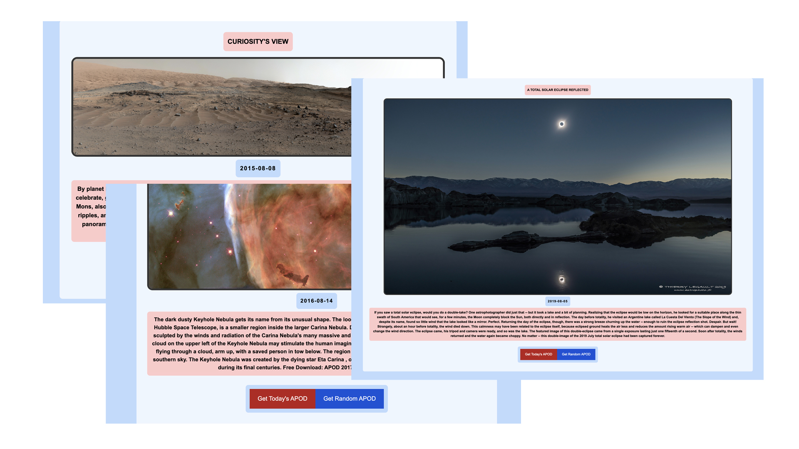

# RANDOM-NASA!

## Overview:
Calling all space enthusiasts! If you are anything like me and you enjoy NASA's Astronomy Pictures of the Day (APOD); than you will enjoy this project! Here' I've taken NASA's daily APOD and allowed users to fetch random APODS for all of NASA's uploads from their archive of APODs. NASA has an archive of images ranging from Jan 1st, 2015 upto the present day. You can either view a random APOD, or get today's APOD. 

## Stack:
The project utilizes Javascript (Vue.Js), HTML5, CSS (Tailwind) and a touch of magic from NASA's Open Source API. If you enjoy projects like these than you will like the other features that I have planned for the future. 
- Inserting textbox to allow user to manually search APODs for a given date. 
- Adding additional containers for users to view images taken by Mars Rovers
- Adding additional containers for users to view satellite images of Earth and other planets.
- Adding additional containers for users to track the ISS (International Space Station)

** If you enjoy projects like these, please feel free to reach out to me and I would be happy to work alongside individuals who share a similar passion.

## Sample Output:

